# Fracture Simulation Pipeline

This flow chart uses the project terminology consistently:

- `Voxel`: cubic volumetric primitive used for discretization.
- `Body`: physical object represented as an assembly of bonded voxels.
- `Bond`: mechanical interaction between neighboring voxels.
- `Bond constraint`: solver-level constraint row associated with an active bond.
- `Contact manifold`: persistent set of active contact constraints for one interacting body pair.
- `Unit quaternion`: body orientation state `q = [w, x, y, z]^T`, with `||q|| = 1`.

## Flow Chart

```mermaid
flowchart TD
    subgraph Setup["Model Setup"]
        A[Input geometry and fixture definition] --> B[Voxelize geometry into voxels]
        B --> C[Assemble voxels into a body]
        C --> D[Create bonds between neighboring voxels]
        D --> E[Assign voxel state:<br/>position, unit quaternion,<br/>velocity, mass, inertia]
        E --> F[Apply supports and loading to selected voxels]
        F --> G[Initialize solver state:<br/>active voxels, bond constraints,<br/>AMR hierarchy, bond incidence]
    end

    G --> H

    subgraph Step["Per Time Step"]
        H[Predict inertial state of each active voxel] --> I[Detect collisions among active voxels]
        I --> J[Group contacts by interacting voxel pair]
        J --> K[Update or create one contact manifold per voxel pair]
        K --> L[Build active contact constraints from each contact manifold]
        L --> M[Warm start active bond constraints and contact constraints]
        M --> N[Iterative AVBD solve]

        subgraph Solve["Inside Each Solver Iteration"]
            N --> O[Primal update:<br/>solve each active voxel against incident<br/>bond constraints and contact constraints]
            O --> P[Dual update:<br/>update bond constraint forces,<br/>contact forces, and penalty stiffness]
            P --> Q{Constraint violation<br/>below tolerance?}
            Q -->|No| O
        end

        Q -->|Yes| R[Collect refinement requests from bond constraints]
        R --> S[Post-convergence cohesive damage pass on capped bonds]
        S --> T{Bond at finest allowed level<br/>or no valid child voxels?}
        T -->|No| U[Keep bond intact;<br/>refinement can still be requested]
        T -->|Yes| V[Advance cohesive damage from bond opening/shear]
        V --> W{Bond fully damaged?}
        W -->|No| X[Keep bond active with degraded effective stiffness]
        W -->|Yes| Y[Mark bond broken and zero its bond constraint response]
        U --> Z{Any voxels marked for refinement?}
        X --> Z
        Y --> Z
        Z -->|Yes| AA[Enforce 2:1 balance, refine a parent voxel into child voxels,<br/>transfer kinematics, seed child bond constraints]
        Z -->|No| AB[Update voxel velocities from solved motion]
        AA --> AB
        AB --> AC[Optional stabilization pass if no refinement occurred]
        AC --> AD[Log energy and export frame/state]
        AD --> H
    end
```

## Code Anchors

- Setup and fixture construction: `tests/L_bar.py`
- Python to Julia solver handoff: `jl_solver/physics_bridge.jl`
- Main time-step loop: `jl_solver/avbd_core.jl`
- Refinement and fracture criteria: `jl_solver/criteria.jl`
- Bond/contact constraint definitions: `jl_solver/avbd_constraints.jl`
